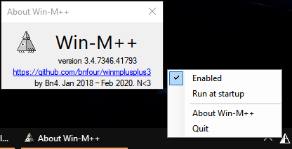

# Win-M++ — an UNSUPPORTED (upgraded) version of Win+M shortcut for multiple displays, version 3

**NOT SUPPORTED ANYMORE**  
This app is no longer supported, because I moved away from the OS it runs on. Should still work on 7 through 10. No idea about 11 compatibility.  
USE AT YOUR OWN RISK

This is pretty much my attempt to rewrite [previous version of the app](https://github.com/bnfour/winmplusplus) in accordance with SOLID principles I was told about in the meantime. This version also has some bugs fixed.

## Usage

**Win+M:** minimize windows on display the currently focused window is on;

**Win+Shift+M:** minimize all windows on all displays, as without this app.

## Configuration

Autostart on system startup may be set on and off from app's tray menu.  
Doubleclick on the icon or "Enable" checkbox in the tray menu toggles this app on and off. When off, default Win+M behavior is restored.  

### Advanced

File `exceptions.txt` contains list of window titles not to minimize ever. Default entries tested to work on English version of Windows 10. Additional entries may be added if necessary -- most likely needed for non-English locales.

## Screenshot

